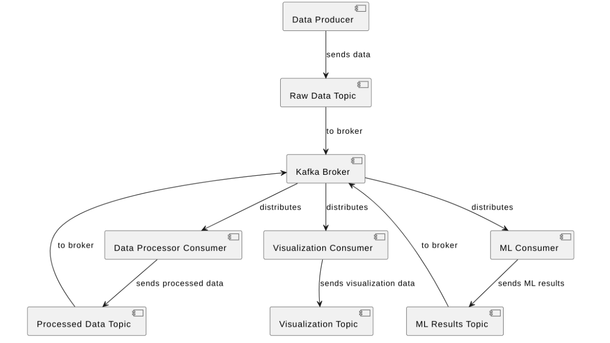
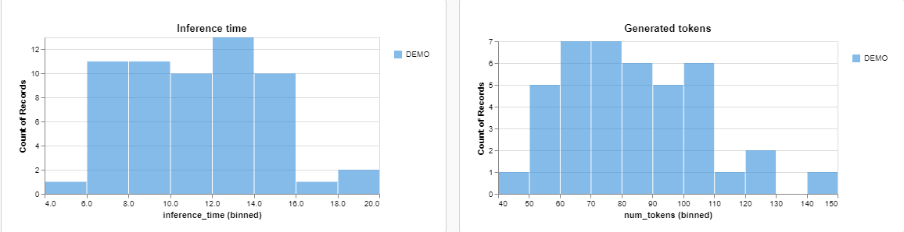

Text Summarizer with Kafka 📩
========================

This project is a system built on **Apache Kafka**. Task is text summarization of cnn news using fine-tuned BART from huggingface.

Architecture ⛓
---------------
***


The application consists of several topics that links with the broker:
- Simulation of data collection
- Text preprocessing
- Summarizing (ML)
- Logging (Visualization)

Data 📚
---------------
***
Here used [CNN dailymail Dataset](https://huggingface.co/datasets/cnn_dailymail) for simulation of data crawling (312k rows).

Article summarization 📝
---------------
***

I took fine-tuned [BART-large](https://huggingface.co/facebook/bart-large-cnn), already fine-tuned for this dataset, for simplicity.
There is a little preprocessing, namely links and html tags removal (that's enough for transformers)

Visualization 📊
---------------
***
Logging and visualization are presented by [wandb](https://wandb.ai).


Run ⚙
---------------
***
*Запуск через subprocess модуль не успел к дедлайну, извините :(, мб попозже доделаю*

1. Get all requirements
```
pip install -r requirements.txt
```

2. Launch Kafka container
If you do not have latest version, get it:
```
docker pull bitnami/kafka
```
Then enable it:
```
docker-compose up -d
```

3. Run all the scripts in separate terminals:

```
python src/data_producer.py
```

```
python src/data_processor.py
```

```
python src/summarizer.py
```
In last script, wandb will ask you to login. Choose any variant you want and sign in.
Note: Check that wandb set ot online format. Enter `wandb online` in terminal before launching
```
python src/logger.py
```

Go to link from last terminal to go to report. Or you can find your runs in wandb workspace in browser.

Stopping 💀
---------------
***
When you are done, close all terminals (Ctrl+C) and make
```
docker-compose down
```

Contacts 🗿
---------------
 - email: cirill2001@bk.ru
 - telegram: @kisozinov